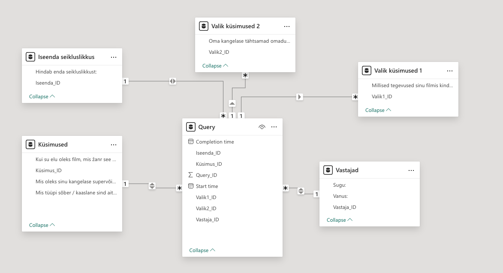
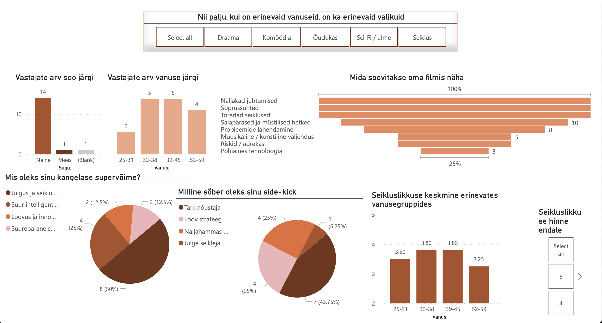
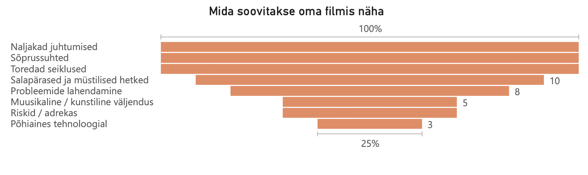
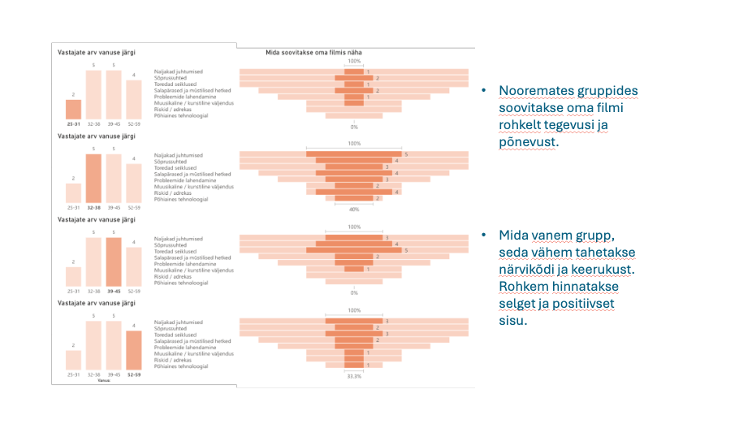
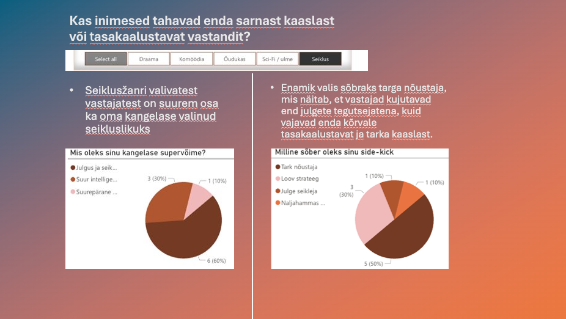

# Analysing Survey Data
Exploring Self-Perception and Behavioural Trends Through Survey Data

## Project overview
### 💡 Why I built this  
This project was created to explore user behaviour data and develop skills in Power BI, data cleaning, and storytelling.

This project focused on collecting and analysing primary data to identify relationships between self-perception, personality traits, and lifestyle preferences. The aim was to apply an end-to-end data analysis workflow, from data collection to insight presentation.

## Tools and technologies  

| Tool | Purpose |
|------|------|
| Microsoft Forms | Surveying and collecting data |
| Excel | Data cleaning |
| Power Query | Data transformation |
| Power BI | Data visualisation |
| PowerPoint | Presenting insights |

## Process
### 1. Data collection
  I designed and distributed an online questionnaire to collect behavioural and demographic data from participants [View Full Questionnaire](https://forms.office.com/r/sQTBBB6HMB)  
  Collected all data into Excel file [Download Excel dataset (.xlsx)](Files/All_Data_From_Survey.xlsx)
### 2. Data preparation
  Cleaned raw data  
  Removed unnecessary variables  
  Standardised formats  
  Validated responses  
  Ensured data quality
### 3. Data modelling and transformation using Power Query and Power BI
  Structured the dataset  
  Created relationships between tables  
  Converted data types  
  Built a usable data model  
    
### 4. Data analysis and visualisation with dashboards
  Age group trends  
  Personality and preference correlations  
  Behavioural patterns  
  Differences between segments  
    
  [Download PowerBI file (.pbix)](Files/PowerBI_visual.pbix)
### 5. Insights and storytelling
  Created a PowerPoint presentation  
  [PowerPoint presentation as PDF](Files/PowerPoint_Presentation.pdf)  
  [Download PowerPoint file (.pptx)](Files/Presentation.pptx)
  #### Key findings included:  
* Participants preferred adventurous and social themes.  
  
* Older groups preferred less complexity and more positive content.  
  
* Respondents often chose complementary personality traits in companions.
    
  
    
  
